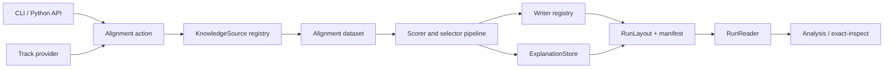
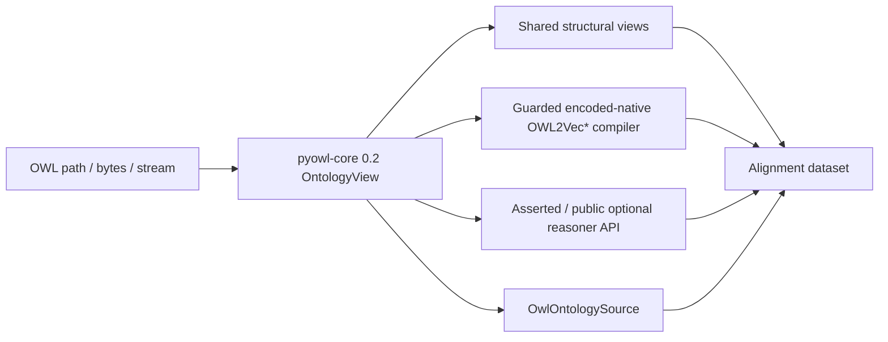

# Architecture

Exact-OM separates stable contracts from replaceable implementations and delivery surfaces.
The matching action resolves data/configuration, builds a `KnowledgeSource`-backed dataset,
runs an ordered model pipeline, writes registered formats, evaluates results, and finalizes a
versioned run.

## Stable seams

- `KnowledgeSource` hides OWL, RDF, and CSV-KG parser details.
- Component registries resolve datasets, models, trainers, and evaluators by stable names.
- Source/writer/track/reasoner entry points allow external plugins without importing them at
  core startup.
- `RunLayout`, `ExplanationStore`, and `RunReader` isolate artifact versions from producers
  and consumers.
- Plain `run_alignment` and `run_evaluation` functions are the action boundary used by CLI and
  Python wrappers.

Import-linter enforces the dependency direction. Core contracts do not import implementations
or delivery code; implementation does not import analysis/delivery; ontology and I/O keep
backend dependencies localized. `exact_inspect` depends on Exact, never the reverse.

## Shared OWL stack

Core 0.2 owns OWL parsing, model-schema-2 identities, immutable views, and wire/mmap
serialization. Exact owns only its source facade and bounded result conversion; it does not
carry a parser, decode encoded structural buffers, or implement an OWL projector.

Each OWL input is loaded exactly once. A concrete snapshot, overlay, composite, or
`SnapshotProvider` result is retained by exact object identity, and all in-process consumers
receive that owner. Exact does not flatten it, reparse a path, request encoded columns, or
materialize a second ontology-sized representation. Optional process isolation writes the
owner once with the current public core wire writer, then a worker verifies and opens it
read-only with mmap. The worker never receives the original OWL path.

Exact requires native loading and encoded-native OWL projection. Legacy `auto` projector
configuration resolves to native; Python/scalar fallback is rejected. The encoded schema and
`pyowl_core.EncodedStructuralView.DESCRIPTOR_SHA256` are checked before accepting results.
The narrow `exact.ontology.native_projection` bridge invokes the installed upstream compiler,
edge policy and report builder under a checked 0.2.0/API-1 contract. Its private compiler/report
coupling is confined to that module; it does not decode buffers or implement projection rules.
Missing capabilities, unsupported inputs and incompatible reports fail explicitly.

The installed projector cannot retain the tested mmap owner's buffers. Mmap remains a public
core/reasoner storage capability, but Exact projection rejects that unsupported owner without
scalar fallback or reparsing. Native document snapshots and supported layered views retain
their original owners. Graph labels are cached on demand; annotation and class-hierarchy
preparation use public typed axiom partitions without unused origin materialization.

## Reproducibility

Normalized source hashes, resolved config fingerprints, dataset-track pins, checkpoints,
timing sessions, evaluator provenance, and deliverable checksums meet in `run_manifest.json`
and `stats/run_stats.json`. Optional integrations fail explicitly when unavailable rather than
silently changing the core algorithm.

For OWL sources, `ontology_stack` adds public distribution/API/schema values, three semantic
fingerprints, closure/resolution and source-document hashes, layered-view provenance, encoded
schema/descriptor identity, projector profile/options/backend, reasoner compiler schemas,
bounded ingestion/copy counters, selected owner/ingestion kinds, cache state, and
verified-wire/mmap status. The serializer omits machine paths, object IDs, pointers, temporary
locations, and credentials.
