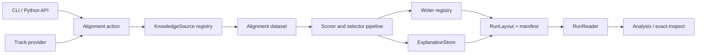

# Architecture

Exact-OM separates stable contracts from replaceable implementations and delivery surfaces.
The matching action resolves data/configuration, builds a `KnowledgeSource`-backed dataset,
runs an ordered model pipeline, writes registered formats, evaluates results, and finalizes a
versioned run.

## Stable seams

- `KnowledgeSource` hides OWL, RDF, and CSV-KG parser details.
- Component registries resolve datasets, models, trainers, and evaluators by stable names.
- Source/writer/track/reasoner entry points allow external plugins without importing them at
  core startup.
- `RunLayout`, `ExplanationStore`, and `RunReader` isolate artifact versions from producers and
  consumers.
- Plain `run_alignment` and `run_evaluation` functions are the action boundary used by CLI and
  Python wrappers.

Import-linter enforces the dependency direction. Core contracts do not import implementations
or delivery code; implementation does not import analysis/delivery; ontology and I/O keep
backend dependencies localized. `exact_inspect` depends on Exact, never the reverse.

## Reproducibility

Normalized source hashes, resolved config fingerprints, dataset-track pins, checkpoints,
timing sessions, evaluator provenance, and deliverable checksums meet in `run_manifest.json`
and `stats/run_stats.json`. Optional integrations fail explicitly when unavailable rather than
silently changing the core algorithm.
