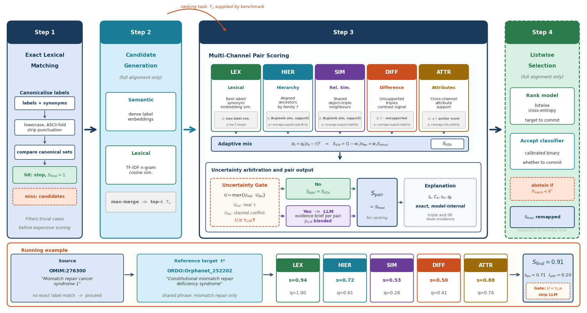
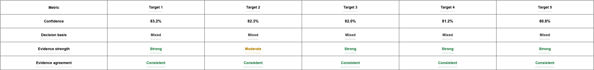

# Exact-OM

Exact-OM predicts correspondences between source and target ontology entities. It combines
lexical label matching, ontology structure, auxiliary attributes, optional LLM arbitration,
and a global candidate selector. Each scored pair can carry an inspectable explanation that
breaks the final score into lexical, structural, and LLM contributions.

## Common workflows

**Global alignment**

:   Let Exact-OM generate candidates, score them, apply threshold and cardinality filters, and
    write a mapping file.

**Local candidate ranking**

:   Supply a candidate file to retain and rank the complete candidate list for each source.

**Audit and review**

:   Save summary and explanation outputs to inspect scores, channel importance, selected
    triples, rationales, and run statistics.

## Start here

- The [user guide](user-guide.md) contains the existing installation, alignment, evaluation,
  analysis, and operations material migrated from the former static site.
- The [configuration reference](reference/configuration/index.md) is generated from the Pydantic
  schema and `exact/default_config.yaml` on every documentation build.
- The [command-line reference](reference/cli/index.md) is generated directly from the `argparse`
  definitions under `exact/delivery/cli/`.
- [Pair-adaptive scoring](pair_adaptive_scoring_slides.md) explains the evidence channels and
  fusion model in depth.

## Pipeline

1. Normalize labels and synonyms and identify exact lexical matches.
2. Generate target candidates for each source in global mode.
3. Score lexical, hierarchy, graph-similarity, difference, and attribute evidence.
4. Fuse reliable evidence channels and optionally arbitrate ambiguous pairs with an LLM.
5. Select correspondences globally or retain a source-local ranking.
6. Export mappings, metrics, timing, and optional explanation artifacts.

