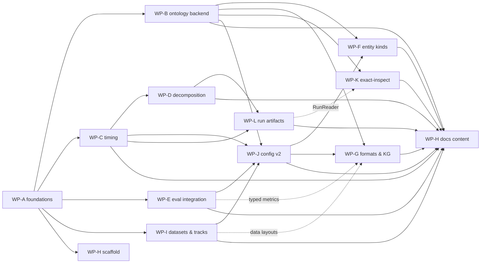

# Exact-OM Overhaul — Implementation Spec Suite

- **Baseline**: commit `9e72ecf` on `main` (2026-07-15). All `file:line` references in these specs are as of this commit; expect small drift and re-locate by symbol name, not line number.
- **Audience**: implementation agents executing the work packages (WPs) below. Each WP spec is self-contained, but read this file, `01-target-architecture.md`, and `02-shared-contracts.md` before starting any WP.
- **Prime directive**: this is a research system with published results. Unless a spec explicitly says otherwise, changes are **behavior-preserving** — same alignments, same scores, same output files — verified by tests and by the parity gates defined in WP-B.

## Goals

1. **Code quality & organization** — remove accumulated iteration cruft, dead code, oversized modules, packaging bugs (WP-A, WP-D).
2. **Extensive evaluation** — integrate [OAEI-Bio-ML-eval](https://github.com/OAEI-ML/OAEI-Bio-ML-eval) as a dependency next to the built-in evaluator (WP-E).
3. **Accurate timing** — a run ledger that stays correct when multiple experiments run over each other in the same directory with caches/resumes (WP-C).
4. **Zero Java** — remove `mowl-borg`/JPype/OWL-API entirely; parse with `py-horned-owl`; reasoning/projection in pure Python (+ optional C-accelerated plugins later), following the [PyLogMap](https://github.com/city-artificial-intelligence/PyLogMap) blueprint (WP-B).
5. **Property & instance matching** — extend matching beyond classes (WP-F).
6. **More formats & pure-KG matching** — OWL/RDF inputs, OAEI-RDF/typed-TSV outputs, CSV+datalog knowledge graphs as in [BioKG-Align-kit](https://github.com/liseda-lab/BioKG-Align-kit) (WP-G).
7. **Documentation** — vastly improved, generated where possible (WP-H).

## Work packages

| WP | Title | Spec | Depends on | Size |
|----|-------|------|------------|------|
| A | Foundations & hygiene | `WP-A-foundations.md` | — | S |
| B | Java-free ontology backend | `WP-B-ontology-backend.md` | A | XL |
| C | Timing ledger | `WP-C-timing.md` | A | M |
| D | Module decomposition & delivery consolidation | `WP-D-decomposition.md` | A, C | L |
| E | OAEI-Bio-ML-eval integration | `WP-E-evaluation.md` | A (final wiring: B) | M |
| F | Property & instance matching | `WP-F-entity-kinds.md` | B | L |
| G | I/O formats & KG sources | `WP-G-formats-kg.md` | B (typed eval: E) | L |
| H | Documentation | `WP-H-docs.md` | scaffold: A; content: all | M |
| I | Dataset & track retrieval (HF + classic OAEI) | `WP-I-datasets-tracks.md` | A | M |
| J | Config schema v2 + migrator | `WP-J-config-v2.md` | A; after B/C/E/I keys land | M |
| K | `exact-inspect` service repackaging | `WP-K-inspect.md` | B | M |
| L | Run artifacts & explanation store | `WP-L-run-artifacts.md` | C, D (coordinates K) | M–L |

Cross-cutting (applies to every WP): `03-performance.md` — benchmark harness, CI perf gates,
compiled-kernel policy. `04-methodology-audit.md` — methodology sanity-check findings; its
non-result-changing fixes (F1–F7) are assigned to WPs A/C/D/E/H/J and are part of their scope.

**Separate plan**: `specs/experiments/` — result-changing methodology improvements (E00–E10).
Runs strictly AFTER this suite completes; nothing from it may be folded into an engineering WP
(promotion rules in its README).

## Execution plan (3 parallel agents + waves)

- **Wave 0 (serial)** — one agent runs **WP-A**. Everything else is blocked on it: WP-A fixes the test harness and CI that every later WP is gated on. Small; land it fast.
- **Wave 1 (parallel)**
  - **Agent 1**: **WP-B** (the largest package). Ships the `exact/ontology/` backend, runs parity, deletes Java.
  - **Agent 2**: **WP-C**, then starts **WP-D** (WP-D consumes WP-C's ledger API when re-instrumenting the trainer).
  - **Agent 3**: **WP-E** against the stubbed adapter seam (final ontology-dependent wiring rebases on WP-B), the **WP-H scaffold** (mkdocs skeleton + CI docs job), then **WP-I** (datasets & tracks — independent of B).
- **Wave 2 (parallel)**
  - **Agent 1**: **WP-F** (entity kinds) on top of WP-B.
  - **Agent 2**: **WP-J** (config v2 — lands first so F/G use v2 key names), then finishes **WP-D**.
  - **Agent 3**: **WP-G** (formats & KG sources), then **WP-K** (`exact-inspect`) once B is merged.
- **Wave 3** — **Agent 2**: **WP-L** (run artifacts & explanation store, right after WP-D since it replaces `audit_io`'s internals; WP-K consumes its `RunReader` — K ships with the v1/monolithic-JSON reader and swaps backends when L lands). Any agent: **WP-H content**, release prep, version bump to `2.0.0` (breaking: Java removal, config v2, CLI/package renames, run-layout v2 — all with migration shims/readers).

Merge order within a wave is by PR readiness; the file-ownership matrix below prevents overlap. If two WPs must touch the same file, the owner listed here wins and the other WP rebases.

## File-ownership matrix

| Path | Wave 1 owner | Wave 2 owner |
|------|--------------|--------------|
| `pyproject.toml`, `.github/`, `tests/` harness, `.gitignore`, `deploy/` | WP-A (wave 0) | — |
| `exact/ontology/` (new), `exact/core/contracts/dataset.py`, `exact/core/entities/ontology.py`, `exact/impl/datasets/*`, `exact/utils/eval.py`, `exact/delivery/*` (JVM removal only), `tools/*` (JVM removal only), `exact/analysis/study_visualizer.py` | **WP-B** | WP-F/WP-G (additive) |
| `exact/utils/timing.py`, `exact/core/actions/alignment.py`, `exact/utils/logs.py` | **WP-C** | WP-D (rebase) |
| `exact/impl/trainer/*`, `exact/impl/models/*`, `exact/analysis/user_study.py`, `exact/delivery/*` (consolidation), `exact/utils/llm_routing.py` | WP-C (trainer: timing hooks only) | **WP-D** |
| `exact/impl/evaluator.py` → `exact/impl/evaluators/`, `exact/core/actions/evaluation.py`, `exact/core/contracts/evaluator.py`, `exact/delivery/cli/eval.py`, `exact/delivery/api/eval.py` | **WP-E** | WP-G (writers only) |
| `exact/io/` (new), output writers in `exact/core/contracts/trainer.py` | — | **WP-G** |
| `exact/core/entities/mappings/*`, `exact/utils/candidate_generation.py` | — | **WP-F** |
| `exact/tracks/` (new), `data/get_data.py`, `exact/utils/data.py` (downloader parts) | **WP-I** | — |
| `exact/core/entities/configs/*`, `exact/default_config.yaml`, `tools/hparam_tuner.py`, `tools/run_exact_job.py` | wave-1 WPs add keys additively | **WP-J** (early wave 2) |
| `study_visualizer_runtime/` → `exact_inspect/`, `explanations_visualizer/` build packaging, `render.yaml`, `deploy/render/` | WP-B (de-Java only) | **WP-K** |
| `exact/runs/` (new), explanation/audit write paths (post-D `impl/trainer/audit_io.py`), `run_manifest.json` layout | — | **WP-L** (wave 3) |
| `docs/`, `mkdocs.yml`, `README.md` | WP-H scaffold | **WP-H** |
| `specs/02-shared-contracts.md` | append-only by any WP that lands an interface change (note it in the PR) | same |

## Conventions & quality gates

- **Branches**: `wp/<letter>-<slug>` (e.g. `wp/b-ontology-backend`). One PR per WP; large WPs (B, D) may split into stacked PRs at the checkpoints marked in their specs.
- **CI must be green** (WP-A installs it): `pytest -m "not requires_data and not slow"`, `black --check`, `isort --check`, `flake8`, `mypy exact`, `lint-imports`. Never weaken a gate to get green; fix the code or flag it in the PR.
- **Performance is a gate, not an afterthought**: follow `03-performance.md` — fixture-scale benchmarks run in CI with a >25% regression fail; compiled (Cython) kernels only for measured hot spots and always with bit-identical pure-Python fallbacks (contracts §15).
- **Core vs plugins**: the core matcher installs with zero optional deps; anything situational (visualizer, HF tracks, bioml eval backend, docs tooling) lives behind an extra (contracts §13) with import-guarded, actionable errors.
- **Tests**: hermetic by default (no network, no GPU, no LLM calls — use the fake backends already present in `tests/`). Data/GPU integration tests carry `@pytest.mark.requires_data` / `@pytest.mark.slow`.
- **Behavior preservation**: WPs A, C, D are refactors — byte-identical outputs expected except where the spec names the fix (e.g. timing values). WP-B has numeric parity gates (see its spec). WPs E, F, G are additive — defaults must reproduce current behavior exactly.
- **Deprecation policy**: public API (`exact/__init__.py` exports, CLI flags, console scripts, output file names) gets a shim + `DeprecationWarning` for one minor release; internal symbols may be renamed freely.
- **Config changes are additive**: new keys with defaults that preserve current behavior; document every new key in `02-shared-contracts.md` §9 and in the generated config reference (WP-H).
- **Every WP**: updates `CHANGELOG.md`, adds Google-style docstrings on new/moved public API, and appends a short *Deviations* note to its own spec file if implementation diverged from the spec.
- **Do not touch**: `Paper/`, `Repair Ideas/`, `explanations_visualizer/` internals (except where WP-A/WP-H say so), committed study bundles under `deploy/render/study_bundles/`.
