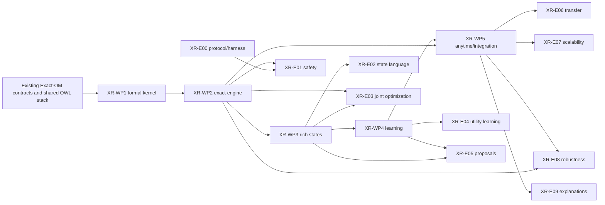

# Exact-Repair research and implementation spec suite

**Suite ID:** `XR-1` 
**Status:** proposed; no implementation or empirical claim is implied 
**Proposal snapshot:** `Repair Ideas/exact_repair_research_proposal.tex`, dated 2026-07-14,
SHA-256 `2f9f588ea0252c10bfbf7582f94c6d616084ef107d905be7347b36a4a5ecb748` 
**Repository baseline:** `08b859d` on `dev`, inspected 2026-07-18

This directory is the only implementation and evaluation plan for **Exact-Repair**, the proposed
reasoner-constrained post-processor for ontology alignments. It translates the research proposal
into bounded, testable work without changing the status or scope of the earlier Exact-OM specs.

## Hard boundary from the earlier specs

- `specs/WP-*.md` describes the Exact-OM overhaul. Those work packages are not reopened or
  renumbered here.
- `specs/experiments/E*.md` describes matching-methodology experiments. Those experiments do not
  provide evidence for repair claims and are not dependencies unless a file below says so.
- Every document in this suite uses an `XR-` identifier. Implementation lives under
  `implementation/`; result-changing studies live under `experiments/`.
- Exact-Repair remains disabled by default until the promotion gate in this file is met. Merely
  landing an implementation work package cannot change Exact-OM's published defaults.
- If an Exact-Repair change needs a shared Exact-OM contract, it must be additive and versioned.
  It does not silently supersede an earlier spec.

The proposal's Java/OWLAPI suggestion is not carried forward. The repository has committed to a
Java-free, shared `pyowl-core` snapshot and optional pyELK/pyHermiT adapters. Exact-Repair must use
that architecture. Upstream pyELK/pyHermiT are committed to complete reasoning and full
justification support at parity with the original Java reasoners; XR-WP2 verifies and measures that
support rather than establishing whether it exists. A failed verification blocks the affected path
explicitly — it is never grounds to reintroduce a second OWL model or parse.

## Reading order

1. [`00-research-contract.md`](00-research-contract.md) — questions, hypotheses, claims, and
   falsification boundaries.
2. [`01-architecture-and-contracts.md`](01-architecture-and-contracts.md) — package layout,
   interfaces, statuses, configuration, and artifact schemas.
3. [`02-experimental-protocol.md`](02-experimental-protocol.md) — common benchmark, metric,
   statistical, and reproducibility rules.
4. [`03-module-soundness.md`](03-module-soundness.md) — what module-restricted checks may and may
   not conclude, per policy family.
5. The relevant `implementation/XR-WP*.md` work package.
6. The corresponding `experiments/XR-E*.md` study. Implementation acceptance is not empirical
   validation; both are required for a research claim.

## Proposal traceability

| Proposal material | Normative XR destination |
|---|---|
| Objectives, scope, assumptions, non-goals | `00-research-contract.md`; XR-1 scope below |
| Formal revision objects, safety policy, conflicts, and utility | `00-research-contract.md`; `01-architecture-and-contracts.md`; XR-WP1 |
| Base, guarded, qualified, replacement, and typed states | XR-WP1/XR-WP3; typed non-class extensions explicitly deferred |
| Lazy optimization and theoretical proof obligations | XR-WP2; XR-E01 exhaustive/certificate conformance |
| Engineering components, failure behavior, and certificates | `01-architecture-and-contracts.md`; XR-WP1/XR-WP2/XR-WP5 |
| Learning tasks, corpus, objectives, and leakage control | XR-WP4; XR-E04–XR-E06 |
| Research questions, benchmarks, metrics, ablations, statistics | `00-research-contract.md`; `02-experimental-protocol.md`; XR-E00–XR-E09 |
| Original WP1–WP6 and milestones | Recut into XR-WP1–XR-WP5 so implementation and empirical validation have separate completion gates |
| Proof appendix, schemas, and logical regression catalogue | XR-WP1/XR-WP2 contracts and tests; XR-E01/XR-E08 evidence |

## Scope of release XR-1

XR-1 targets class correspondences between two OWL ontologies. The immutable core comprises both
ontologies and any pinned/trusted mappings. Each provisional class mapping becomes one revision
object with a finite state set. The supported state families are introduced in stages:

1. off, equivalence, source-subsumed-by-target, and source-subsumes-target;
2. symmetric guarded directions from a bounded OWL 2 EL-compatible grammar;
3. independently selectable qualification components;
4. bounded, provenance-bearing endpoint replacements.

The solver selects one state per revision object. A complete safety oracle verifies the selected
assignment under a declared monotone policy. Only a verified assignment can be returned as safe.
Learning may rank states, propose finite candidates, or prioritize search; it may not decide
logical admissibility.

Object-property, data-property, and individual repair require separate compiler versions and a
new suite revision. They are not hidden stretch goals of XR-1.

## Programme map

| Implementation WP | Outcome | Research questions bounded | Required experiment evidence |
|---|---|---|---|
| [XR-WP1](implementation/XR-WP1-formal-kernel.md) | Versioned domain model, class-state compiler, policy kernel, certificate/replay schemas | RQ1, RQ2, RQ3, RQ10 infrastructure only | XR-E00, XR-E01 |
| [XR-WP2](implementation/XR-WP2-exact-engine.md) | Complete-or-fail-closed oracle, optimizer, exact lazy loop, base states | RQ1, RQ4, RQ9 | XR-E01, XR-E03, XR-E08 |
| [XR-WP3](implementation/XR-WP3-rich-state-language.md) | Guards, qualifications, replacements, candidate provenance | RQ2, RQ3, RQ6 | XR-E02, XR-E05 |
| [XR-WP4](implementation/XR-WP4-learning.md) | Corruption corpus, utility models, bounded proposal models, structured training | RQ5, RQ6, RQ7 | XR-E04, XR-E05, XR-E06 |
| [XR-WP5](implementation/XR-WP5-anytime-integration.md) | Anytime bounds, decomposition, Exact-OM adapter, CLI/API, run artifacts | RQ7, RQ8, RQ9, RQ10 | XR-E06–XR-E09 |

The experiment index and exact dependency rules are in
[`experiments/README.md`](experiments/README.md).

The programme-map and study-matrix tables are normative; this diagram is illustrative.

## Stage gates

| Gate | Requirement | What it authorizes |
|---|---|---|
| G0 — contract freeze | `00`–`03` reviewed; schema IDs, status semantics, supported profiles, module-soundness lemmas, and primary outcomes frozen | implementation begins |
| G1 — kernel conformance | XR-WP1 acceptance tests and certificate round-trip pass | exact engine work begins |
| G2 — safety kernel | XR-WP2 passes exhaustive small-instance checks, its measured oracle-throughput audit is accepted, and the XR-E01 pilot has zero false-safe outputs | rich-state and learning studies begin; no production default |
| G3 — candidate language | XR-WP3 passes compiler, non-vacuity, and provenance gates | XR-E02/XR-E05 comparative studies begin |
| G4 — frozen evaluation | XR-E00 pilot fixes numerical thresholds, dataset releases, exclusions, and analysis scripts before test-set runs | confirmatory experiments begin |
| G5a — base integration candidate | XR-E01 remains eligible on base states with hand-coded utility; XR-E07 validates anytime gaps for the base configuration | opt-in base-state (off/direction-only) Exact-OM integration may be released |
| G5b — rich-state and learned enablement | XR-E02 shows preservation gain; XR-E04 shows held-out regret gain; XR-E05 shows adequate candidate recall | rich-state families and learned utilities may be enabled in the opt-in integration |
| G6 — default promotion | all applicable go/no-go criteria pass, an explicit decision record names the chosen policy/model, and a migration note is approved | a later release may consider enabling repair by default |

G5a, G5b, and G6 are separate. Certified base-state repair is a shippable capability on its own; a
negative rich-state or learning result narrows G5b without blocking G5a. A safe research prototype
is not automatically an acceptable product default.

## Minimum publishable unit and de-scoping

The smallest self-contained result is XR-WP1 → XR-WP2 (base states, hand-coded utility) plus
XR-E00/XR-E01 on Conference/Anatomy-scale corpora: a certified, replayable exact repair supporting
RQ1 and a G5a integration candidate. Everything else extends that unit.

If capacity forces cuts, remove in this order; each cut removes only its own claims:

1. XR-E09 and the expert-explanation surface (drops RQ10);
2. XR-E06 and transfer claims (drops RQ7);
3. the L2/L3 learned proposal and prioritization arms of XR-WP4/XR-WP5 (narrows RQ6 and RQ8);
4. learned utility, XR-E04 (drops RQ5), leaving hand-coded utility;
5. XR-WP3 rich states (drops RQ2/RQ3/RQ6), leaving the minimum unit.

A cut is recorded as a suite amendment, not silently abandoned.

## Decision register

The proposal leaves several choices open. They are frozen at the named gate rather than smuggled
into an implementation PR.

| Decision | Freeze/evidence owner |
|---|---|
| Default safety policy and monitored signature | G0 contract review; XR-E01 reports each query family separately |
| Complete reasoner/explanation stack by OWL profile | XR-WP2 conformance/throughput audit; unverified profiles remain unsupported |
| Exact master backend | XR-WP2 ADR using deterministic conformance/licensing/packaging checks |
| Guard/replacement/state budgets | XR-E00 pilot; XR-E05 candidate-recall/cost evidence |
| Utility semantics and lexicographic tiers | G0 external-evaluation contract; XR-E03/XR-E04 evidence |
| Mapping cardinality constraints | off/soft by default; any hard governance rule is a named experimental variant |
| Expert escalation threshold | XR-E00 pilot and XR-E09 evidence; it cannot change logical safety |
| Complex expression grammar | XR-1 remains bounded EL-compatible; any DL constructor is a suite-version change |
| Single versus top-k/Pareto repair output | research artifact first; production choice follows XR-E09 and cost evidence |
| Training source mixture and adaptation budget | XR-WP4 split manifest; XR-E04/XR-E06 frozen protocols |

## Cross-cutting invariants

Every implementation work package must preserve these invariants:

1. **Fail closed.** `UNKNOWN`, timeout, unsupported input, missing explanation, or incomplete
   reasoning never becomes a safe result.
2. **One OWL snapshot model.** The source, target, generated state axioms, reasoner, and replay
   path use compatible `pyowl-core` representations without path-based reparsing.
3. **Frozen finite search space.** Exact optimality is relative to the recorded state inventory,
   compiler version, utility, policy, and governance constraints.
4. **Safe is not optimal.** Safety, verification method, objective value, bound, and gap are
   separate fields.
5. **Complete provenance.** Every generated mutable axiom maps back to exactly one selected state;
   every cut maps to a violation/explanation or a separately validated conditional policy check.
6. **Determinism.** Canonical state IDs, integer objectives, stable serialization, hashes, and
   seeds make certificates replayable.
7. **No result claims from tests.** Unit and acceptance tests establish contract conformance only.
   Research claims require the named experiments.
8. **No hidden defaults.** Installing a solver, reasoner, or learned checkpoint does not enable
   repair or change Exact-OM matching outputs.

## Definition of programme completion

XR-1 is complete only when all five implementation WPs have their acceptance evidence, all
confirmatory experiments required by the selected release claim have frozen artifacts, every
reported safe output is replayable, and the final report explicitly records rejected hypotheses,
unsupported profiles, timeouts, fallbacks, and non-comparable baselines.
